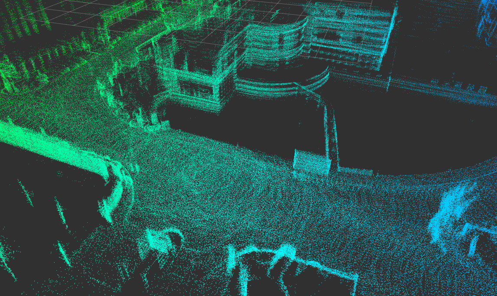
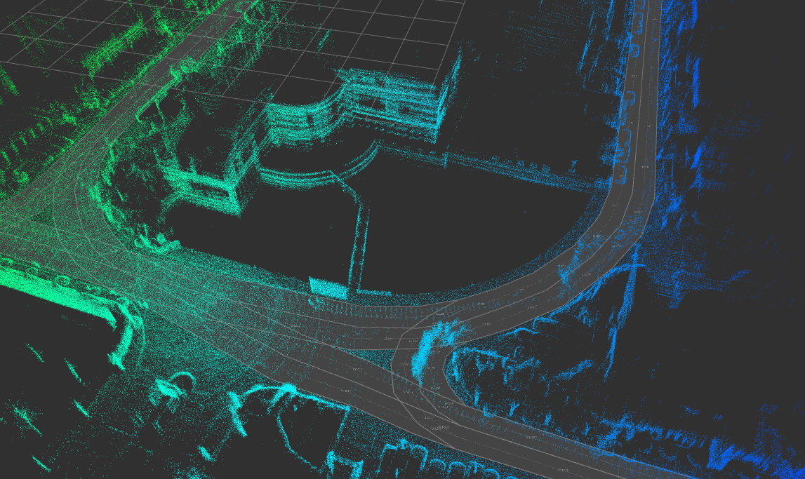
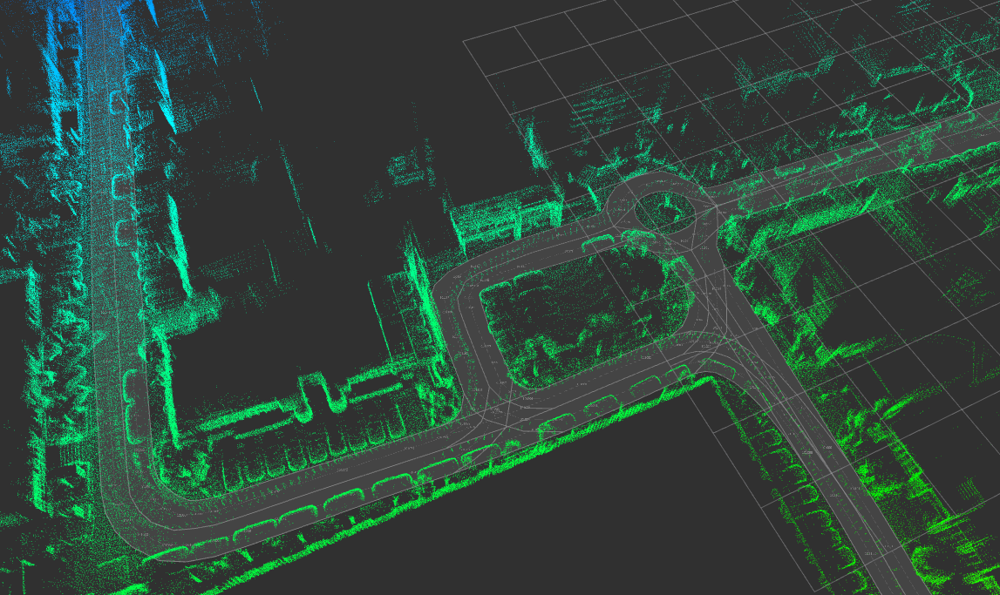

## Summary
After getting a pointcloud map with for example [LeGo-LOAM](https://github.com/RobustFieldAutonomyLab/LeGO-LOAM) in rosbag file, load it to JOSM with real scale for easier lane map drawing.

End results:

## Prerequisite
* [ROS1](https://www.ros.org/), tested with melodic & noetic
* [JOSM](https://josm.openstreetmap.de)
* [Lanelet2](https://github.com/fzi-forschungszentrum-informatik/Lanelet2)
* [3D_Slam_tools](https://github.com/youliangtan/3D_Slam_tools)

###